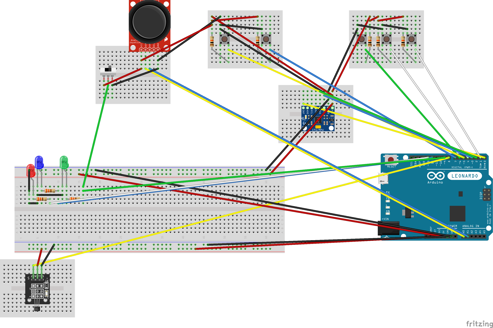
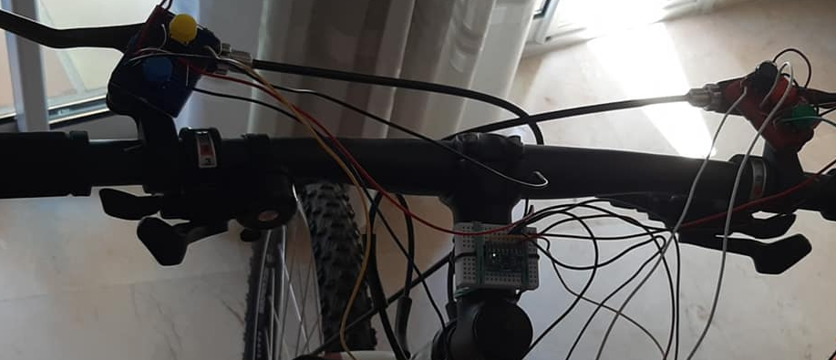
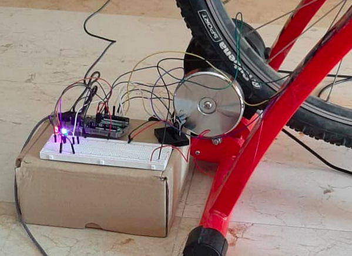
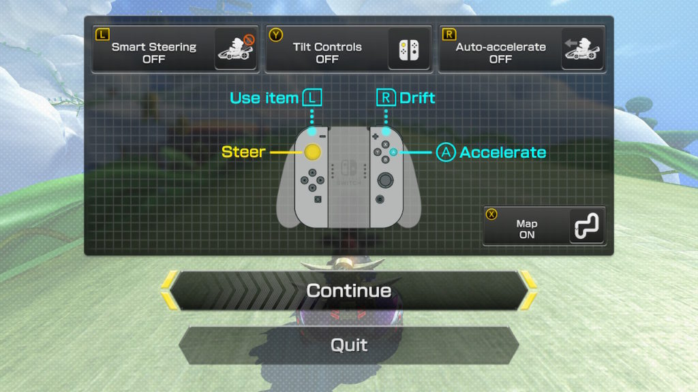

# Bike Mario Kart Project
Play the Nintendo Switch racing game "Mario Kart 8 Deluxe" using a real bike.
[Project in Arduino Hub](https://create.arduino.cc/projecthub/Martouta/real-bike-mario-kart-8-deluxe-f6537f)

## Setup
Using a Linux OS with Arduino IDE 1.6.6 (or above). for Mac it must be very similar. For Windows not so much but it must be doable anyway.
For now only for Arduino Leonardo and not any other microcontroller.

### External libraries
These are the libraries that you need to download:
- [SwitchJoystick](https://github.com/HackerLoop/Arduino-JoyCon-Library-for-Nintendo-Switch)
- [MPU6050](https://github.com/jrowberg/i2cdevlib/tree/master/Arduino/MPU6050)
- [I2Cdev](https://github.com/jrowberg/i2cdevlib)

### Physical Requirements
- A real bicycle.
- A stationary stand for the back wheel. Make sure that it has like a small 'wheel' of steel or any other material where you can put a magnet on it. I also strongly recommend that it is one of those with noise reduction.
- A neodymium magnet.
- A hall effect sensor. Personally, I have `KY-003` which also contains a `voltage regulator` so it works with any voltage from 3.3V to 5V. For the circuit I may assume that you have a voltage regulator too.
- A `MPU6050`. Technically, any 6 axis accelerometer sensor (which contains an _accelerometer_ and a _gyroscope_) would do, but your would need to adapt the code if it is not a `MPU6050`. Personally, I use the `GY-521`, which is a `MPU6050` with a voltage regulator to work with any voltage from 3.3V to 5V. For the circuit I may assume that you have a voltage regulator too. You can buy it soldered (in 1 piece) or solder it yourself.
- An Arduino Leonardo.
- An AC adapter of 9V for the Arduino.
- 4 small breadboards and 1 big one as well.
- 5 push buttons of 4 legs each.
- 3 LEDs.
- 3 Resistors of 330Ω and 5 resistors of 10KΩ (although 5KΩ might be enough).
- Cables to connect everything together. This can be done in many different ways but I bought long cables and cut them and strip them myself with the right size to then stick them to the big with some sticky tapes.
- A Nintendo Switch. In my case with the Dock as well.
- The game "Mario Kart 8 Deluxe" for the console.
- USB cable of A type to connect to the laptop and micro type to connect to the Arduino. Then, I use the same cable to connect the Arduino to the Dock, but if you do not have the Dock, I guess that you will need an adapter or another cable to connect it directly to the Switch (which uses C type).
- Joystick (usually sold as the one of the PS2).
- SPTD Switch interruptor.


### Circuit
General schematics:

You can also [download the file for Fritzing (release v1.0.0)](https://fritzing.org/media/fritzing-repo/projects/r/real-bike-mario-kart-8-deluxe/fritzing/bike.fzz) with more details of the schematics in the [Fritzing Project site](https://fritzing.org/projects/real-bike-mario-kart-8-deluxe).
The most recent version is in this same project, in the file `bike.fzz`.

In the front side there are the _GY-521_ almost right in the middle of the rotation (or at least enough like to detect the rotation well) and the buttons.


In the back side there is everything else in my case, but most of it doesn't matter where you put it, except for the magnet and the _hall effect sensor_ that must stay there in the back to detect the speed.


It is not obvious but in that grey/silver small 'wheel'/circle, that spins when the real bike wheel does, there is a small magnet that I neodymium added.
What you see very close to it is the _hall effect sensor_, that detects when the magnet is in front of it and when it isn't. The red LED of the circuit should have light only when the magnet is being detected (outside of 'startup time' tho, when you are already playing :wink: ).

### How to upload the code
Download this code from Github. Put everything in a folder with the name `bike`. Wherever you want to locate that folder should work.

Install the [Arduino IDE](https://www.arduino.cc/en/main/software). It must be the version 1.6.6 or above.

Create the sketchbook folder from the terminal and add the necessary config by typing the following commands in the _Terminal_.
That is being `32` in my case the hightest number I see in `ls /snap/arduino/`.
Not sure if the last command is necessary or a bad idea, so I recommend trying without it first.
```
mkdir -p ~/snap/arduino/switch/Arduino/libraries
sudo cp -R /snap/arduino/32/hardware ~/snap/arduino/switch/Arduino/.
sudo chown -R $USER:$USER ~/snap/arduino/switch/Arduino/hardware
sudo chmod 777 ~/snap/arduino/switch/Arduino/hardware/boards.txt
```

Add the external libraries that you downloaded with their respective folders (the folders must have the same name of the name of the library as mentioned above) inside `~/snap/arduino/switch/Arduino/libraries`.

In the Arduino IDE, go to `File -> Preferences` and change the `Sketchbook location` to be `~/snap/arduino/switch/Arduino`.

Add this at the end of `~/snap/arduino/switch/Arduino/hardware/boards.txt` using any text editor (vi, nano, emacs, gedit, atom, sublime, etc.):
```
##############################################################

nintendoSwitch.name=SwitchJoystick
nintendoSwitch.vid.0=0x0F0D
nintendoSwitch.pid.0=0x8092
nintendoSwitch.vid.1=0x0F0D
nintendoSwitch.pid.1=0x0092

nintendoSwitch.upload.tool=avrdude
nintendoSwitch.upload.protocol=avr109
nintendoSwitch.upload.maximum_size=28672
nintendoSwitch.upload.maximum_data_size=2560
nintendoSwitch.upload.speed=57600
nintendoSwitch.upload.disable_flushing=true
nintendoSwitch.upload.use_1200bps_touch=true
nintendoSwitch.upload.wait_for_upload_port=true

nintendoSwitch.bootloader.tool=avrdude
nintendoSwitch.bootloader.low_fuses=0xff
nintendoSwitch.bootloader.high_fuses=0xd8
nintendoSwitch.bootloader.extended_fuses=0xcb
nintendoSwitch.bootloader.file=caterina/Caterina-Leonardo.hex
nintendoSwitch.bootloader.unlock_bits=0x3F
nintendoSwitch.bootloader.lock_bits=0x2F

nintendoSwitch.build.mcu=atmega32u4
nintendoSwitch.build.f_cpu=16000000L
nintendoSwitch.build.vid=0x0F0D
nintendoSwitch.build.pid=0x0092
nintendoSwitch.build.usb_product="POKKEN CONTROLLER"
nintendoSwitch.build.board=AVR_LEONARDO
nintendoSwitch.build.core=arduino
nintendoSwitch.build.variant=leonardo
nintendoSwitch.build.extra_flags={build.usb_flags}

```

Replace inside `~/snap/arduino/switch/Arduino/hardware/platform.txt` the line `build.usb_manufacturer="Unknown"` with `build.usb_manufacturer="HORI CO.,LTD."`.

Close and open again the Arduino IDE so it can read the changes made in the previous steps when it starts up.
Open the file `bike.ino` of this code that you downloaded and saved inside a folder called `bike`.

In the Arduino IDE, Go to `Tools` and select the board _SwitchJoystick_. Then, select the programmer `Arduino as ISP (ATmega32U4)`.

You may need to do this from the _Terminal_ to have permissions:
```
sudo usermod -a -G dialout $USER
sudo systemctl stop ModemManager.service
sudo systemctl disable ModemManager.service
```

Keep your finger pressing the "reset" button of your Arduino Leonardo while you press once (not keeping pressed) the "Upload" button in the Arduino IDE. Release the "reset" button as soon as you see in the IDE "Uploding ...".

If it works, at the end of the upload, you should see a message similar to this one:

> avrdude: 16824 bytes of flash verified  
> avrdude done.  Thank you.

## How to play
First, you need to know how to play the game itself with the JoyCons. There are many good tutorials out there, but this is how to play in a nutshell:


As for playing with this sketch/code, you will need the JoyCon(s) to select the game in the Nintendo Switch and navigate in the menus and these things.
When you want the Arduino to start sending data to your Nintendo Switch, press the button equivalent to the A from the bike. After that, you will be able to play from the bike :smile:.
